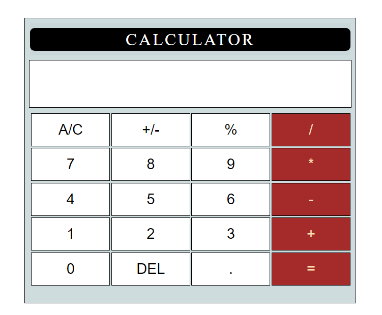

# Calculator-App
This is basic calculator app with a simple user interface which runs on your browser and can be used to perform mathematical operations.

## Functionality

The Calculator Can perform various chained mathematical operations . I made this as mini project while learning javascript . This app can be used by anyone while using a laptop to perform simple operations given the Minimilas UI .

## SETUP
>No setup is needed for the project ! Just Download the Project files and run on the browser!
